# Entity Relationship Diagram (ERD) & Schema Details

This document outlines the database schema, relationships, and Row-Level Security (RLS) policies for the Senior Citizen Assistance Platform.

## Mermaid ERD

```mermaid
erDiagram
    user_profiles ||--o| user_addresses : has
    user_profiles ||--o{ id_documents : uploads
    user_profiles ||--o| digital_ids : owns
    user_profiles ||--o{ medicine_requests : makes
    user_profiles ||--o{ assistance_requests : requests

    medicines ||--o{ medicine_requests : "is requested in"

    admin_users ||--o{ admin_logs : creates
    admin_users ||--o{ assistance_requests : manages

    user_profiles {
        uuid id PK "references auth.users(id)"
        text phone "unique"
        text full_name
        date birthdate
        integer age
        text verification_status "PENDING_ADMIN_REVIEW, APPROVED, REJECTED, NEEDS_CLARIFICATION"
        text language_preference
        boolean sms_notifications
        timestamptz created_at
        timestamptz updated_at
    }

    user_addresses {
        uuid id PK
        uuid user_id FK "references user_profiles(id)"
        text street
        text barangay
        text municipality
        text province
        text region
        text zip_code
        float latitude
        float longitude
        timestamptz created_at
        timestamptz updated_at
    }

    id_documents {
        uuid id PK
        uuid user_id FK "references user_profiles(id)"
        text id_type
        text file_url
        text verification_status "PENDING, APPROVED, REJECTED"
        text rejection_reason
        timestamptz upload_date
        timestamptz created_at
        timestamptz updated_at
    }

    digital_ids {
        uuid id PK
        uuid user_id FK "references user_profiles(id)"
        text id_number "unique, e.g. SC-REGION-YEAR-SEQUENCE"
        text qr_code_url
        date issue_date
        date expiry_date
        text status "ACTIVE, EXPIRED, REVOKED"
        timestamptz created_at
        timestamptz updated_at
    }

    medicines {
        uuid id PK
        text name
        text generic_name
        text description
        text dosage_strength
        text unit
        text usage_instructions
        integer available_quantity
        boolean is_active
        timestamptz created_at
        timestamptz updated_at
    }

    medicine_requests {
        uuid id PK
        uuid user_id FK "references user_profiles(id)"
        uuid medicine_id FK "references medicines(id)"
        integer quantity
        text reason
        text prescription_url
        text status "PENDING, APPROVED, DISPENSED, COMPLETED, REJECTED"
        text pharmacist_notes
        timestamptz request_date
        timestamptz dispense_date
        timestamptz created_at
        timestamptz updated_at
    }

    assistance_requests {
        uuid id PK
        uuid user_id FK "references user_profiles(id)"
        text category "Medicine, Healthcare, Food, Transport, Social, Other"
        text description
        text urgency_level "Normal, Urgent"
        uuid address_id FK "references user_addresses(id)"
        text status "PENDING, IN_PROGRESS, COMPLETED, REJECTED"
        uuid assigned_to FK "references admin_users(id)"
        timestamptz created_at
        timestamptz updated_at
    }

    admin_users {
        uuid id PK "references auth.users(id)"
        text full_name
        text role "SUPER_ADMIN, PHARMACIST, REGIONAL_ADMIN"
        boolean is_active
        timestamptz created_at
        timestamptz updated_at
    }

    admin_logs {
        uuid id PK
        uuid admin_id FK "references admin_users(id)"
        text action
        text target_id
        text target_type
        jsonb details
        text status "SUCCESS, ERROR"
        timestamptz created_at
    }
```

## Row-Level Security (RLS) Strategy

- **`user_profiles`, `user_addresses`, `id_documents`, `digital_ids`**: 
  - Users can `SELECT`, `UPDATE` (where allowed) their own rows using `auth.uid() = id` (or `user_id`).
  - Admins can `SELECT`, `UPDATE` all rows based on role check in `admin_users`.
- **`medicines`**: 
  - Users can `SELECT` where `is_active = true`.
  - Admins can `INSERT`, `UPDATE`, `DELETE`, `SELECT` all.
- **`medicine_requests`, `assistance_requests`**:
  - Users can `SELECT`, `INSERT` where `user_id = auth.uid()`.
  - Admins can `SELECT`, `UPDATE` all rows.
- **`admin_users`, `admin_logs`**:
  - Only accessible by `admin_users` with appropriate roles. Users cannot `SELECT`.
